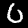
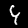
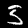
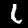

# MNIST Digits Based On Decimal Positional Number Formula

Example from Tsoutsouras et al.[^0]
Compute number from MNIST digits based on decimal positional number formula.

## Inputs

Labels given by 48 humans in response the question "What digit does this image represent?", for each of the images (included in the `inputs/` directory).

## Outputs
Results in a distribution of the number represented by the order of digits given by the images:

## Licenses

The code is distributed with a BSD 3-Clause "New" or "Revised" License, see `LICENSE.txt`.

The MNIST images are copyrighted by Yann LeCun and Corinna Cortes.
The MNIST dataset, which is a derivative work from original NIST datasets.
MNIST dataset is made available under a [Creative Commons Attribution-Share Alike 3.0 license](https://creativecommons.org/licenses/by-sa/3.0/).

[^0]: Vasileios Tsoutsouras, Orestis Kaparounakis, Bilgesu Arif Bilgin, Chatura Samarakoon, James Timothy Meech, Jan Heck, Phillip Stanley-Marbell: The Laplace Microarchitecture for Tracking Data Uncertainty and Its Implementation in a RISC-V Processor. MICRO 2021: 1254-1269
